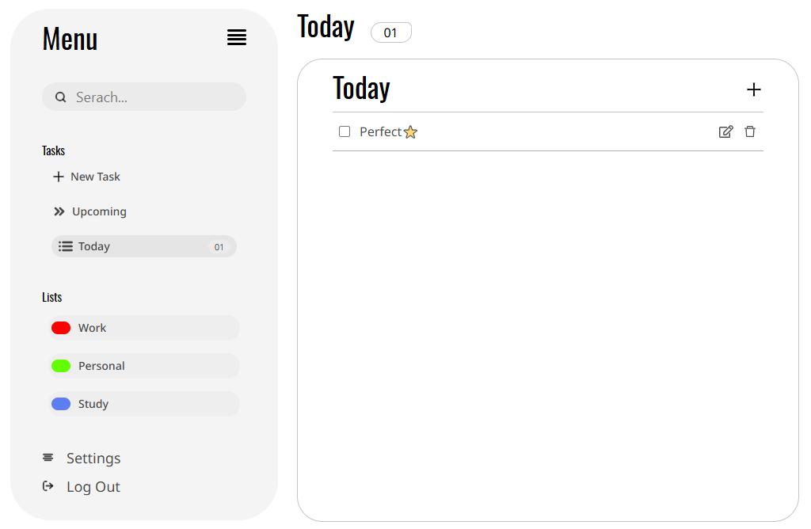
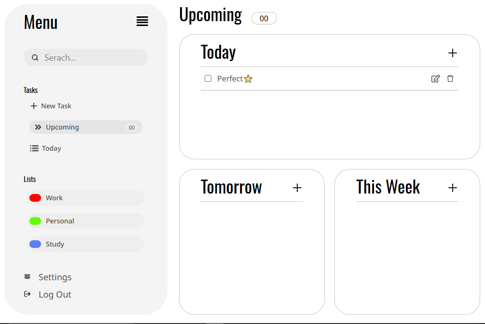

# To-Do App with React

> A simple, clean, and responsive To-Do application built with React to manage daily, upcoming, and weekly tasks efficiently.

---

## Table of Contents
- [Overview](#overview)
- [Features](#features)
- [Screenshots](#screenshots)
- [Installation](#installation)
- [Usage](#usage)
- [Technologies](#technologies)
- [Contributing](#contributing)
- [Onlien Demo](#onlien-demo)


## Overview
This project is a **React-based To-Do application** where users can:
- Create, edit, and delete tasks
- Organize tasks by time (`Today`, `Tomorrow`, `This Week`)
- Categorize tasks into lists such as `Work`, `Personal`, and `Study`
- Track the number of tasks per category and list  

The app focuses on a **minimal and user-friendly design**, making task management simple and effective.  

---

## Features
- **Add Tasks:** Quickly add new tasks with one click.  
- **Edit Tasks:** Modify task details anytime.  
- **Delete Tasks:** Remove tasks easily with a single click.  
- **Organize by Time:** View tasks scheduled for `Today`, `Tomorrow`, and `This Week`.  
- **Categorize by Lists:** Separate tasks into lists like `Work`, `Personal`, and `Study`.  
- **Task Counter:** Keep track of how many tasks are in each category.  
- **Search Tasks:** Quickly find tasks using the search bar.  
- **Responsive Design:** Works well on desktop and mobile screens.  
- **Simple UI:** Minimal design for clear and easy navigation.  

---

## Screenshots
### Dashboard / Today


### Upcoming Tasks


## Onlien Demo
> Click [here](https://to-do-app-with-react-jep4.vercel.app/) to watch it online


## Installation
Follow these steps to set up the project locally:

**1. Clone the repository**
```bash
git clone https://github.com/01mehran/To-Do-App-With-React.git
```

**2. Go to directory**
```bash
yarn install
```

**3. Install dependencies**
```bash
cd To-Do-App-With-Reac
```

**4. Run project**
```bash
yarn dev
```


## Usage

- Navigate through the sidebar to access:

- Today: Tasks due today

- Upcoming: Tasks for future days

- Lists: Categorized task lists (Work, Personal, Study)

- Add a Task: Click the + button and enter your task details.

- Edit a Task: Click the edit icon to modify a task.

- Delete a Task: Click the trash icon to remove a task.


## Technologies

1. React – Front-end library for building UI

2. Tailwind CSS – For styling and responsive design

3. React Hooks – State and lifecycle management

4. Vite


## Contributing

1. Contributions are welcome!

1. Fork the repository.

1. Create a branch (git checkout -b feature-name).

1. Make your changes.

1. Commit your changes (git commit -m 'Add some feature').

1. Push to the branch (git push origin feature-name).

1. Open a Pull Request.


>⭐ If you like this project, don’t forget to give it a star!